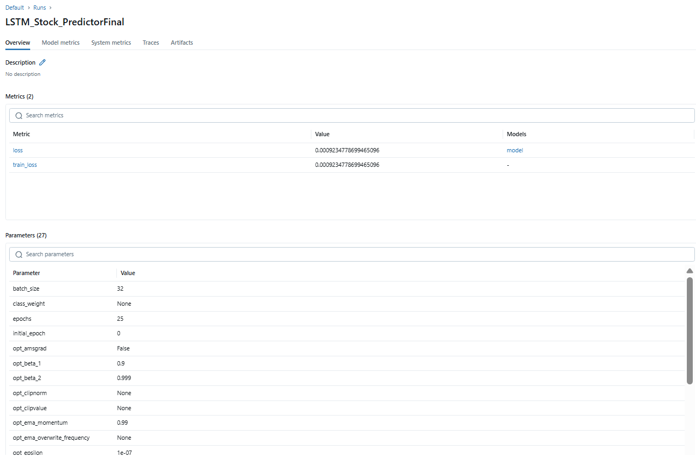

# 🧠 Stock Predictor with MLflow Tracking

A machine learning project that predicts stock prices using deep learning models, with full experiment tracking using **MLflow**.

## 🚀 Features
- Predicts stock trends or prices using neural networks using LTSM
- Automatically tracks metrics, parameters, and models using MLflow

## 📦 Installation

```bash
git clone https://github.com/Rayan-MJ/Stock-Predictor-MLflow.git
cd Stock-Predictor-MLflow
pip install yfinance numpy pandas scikit-learn tensorflow mlflow
```
## 📈 **Usage / Prediction**
```python
from tensorflow.keras.models import load_model
import joblib

# Load Model & Scaler
model = load_model("stock_model.keras")
scaler = joblib.load("scaler.pkl")
```
```python
import yfinance as yf
import numpy as np

# Example
data = yf.download("AAPL", start="2024-09-01", end="2024-10-23")

# use only Close column
close_data = data['Close'].values.reshape(-1, 1)

# scale with SAME scaler
scaled_data = scaler.transform(close_data)
```
```python
sequence_length = 60 #It tells how many previous days to look at when predicting the next value.
X_test = []
X_test.append(scaled_data[-sequence_length:]) 

X_test = np.array(X_test)
X_test = np.reshape(X_test, (X_test.shape[0], X_test.shape[1], 1))
predicted_scaled = model.predict(X_test)

# convert back to original price scale
predicted_price = scaler.inverse_transform(predicted_scaled)

print("Predicted next close price:", predicted_price[0][0])
```

## 📝 MLflow


